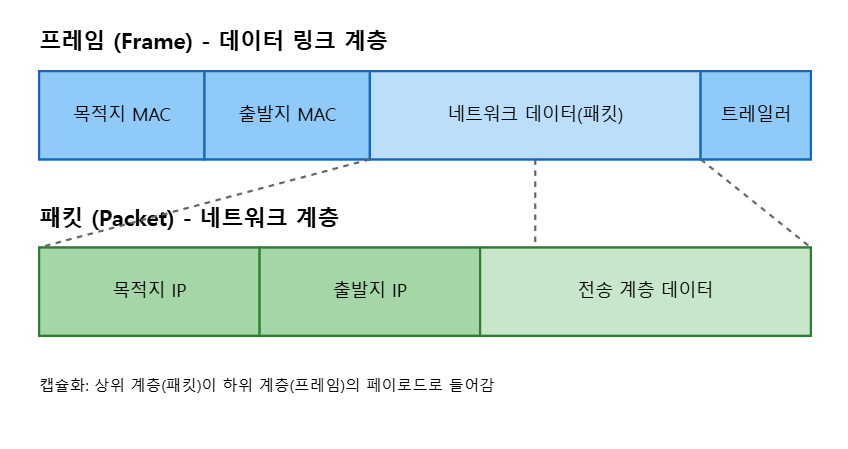

# 네트워크 계층 (L3, Network)

## IP주소

> IP: 135.182.15.17 처럼 네트워크의 고유한 주소를 말한다. 네자리 수로 되어있다.

- 0부터 255의 조합으로 된 총 네자리수의 조합으로 이루어져있다.

  - 256 x 256 x 256 x 256 의 구성임

### 왜 256인가요?

256이 2의8승이기때문에 256의 숫자가 나왔다.

여기서 2의8승에서 숫자2는 컴퓨터 언어는 0과1 두개의 언어로 이루어져있기 때문에 2이다.

0~255의 조합이 컴퓨터 언어로 1111 1111 1111 1111 이런식으로 8자리씩 끊기기 때문에 2의8승이 됐고, 2의8승은 32bit다.

## Ipv6

네트워크들이 많아지면서 할당가능한 IP 주소가 다 차버렸다.

그렇게해서 `Ipv6` 이 나오게 됐다.

Ipv6는 128bit로, 43억의 4승이기 때문에 절대 고갈 될 수 없다.

> IP는 `사설Ip`와 `공인IP` 두가지가 있다.
> 사설IP는 처음 시작이 10 혹은 172 혹은 192 혹은 168로 시작한다.
> 공인IP 주소를 알아야 네트워크 연결이 가능하다.

## 프레임

> 프레임(Frame)은 데이터 링크 계층(Layer 2)에서 사용되는 기본 전송 단위

### 구조

목적지 MAC + 출발지 MAC + `네트워크 데이터(패킷)` + 트레일러

#### 네트워크 데이터

위의 구조에서 `네트워크 데이터` 구조를 살펴보면,

목적IP(옆 라우터) + 출발 IP(내 라우터) + 전송계층(전송계층 데이터)으로 되어있는데 이러한 구조를 `패킷`이라고한다

## 정리

- 네트워크에는 대표주소인 IP가 있다.

  - 개수 한정으로 내부 네트워크는 사설 IP를 사용한다.

- EX) 공인 IP: 123.45.67.89
- 사설IP: 192 혹은 168 혹은 172.16~172.31 혹은 10으로 시작한다.
- 특수IP(Loopback): 127.0.0.0.1 = localhost
